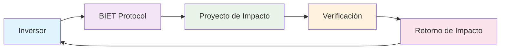

# Introducción a BIET Network

BIET Network es una plataforma descentralizada de inversión de impacto y tokenización que permite a los inversores participar en proyectos de impacto social y ambiental mientras generan retornos financieros.

## ¿Qué es BIET Network?

BIET Network (Blockchain Impact & Environmental Tokenization) es un ecosistema DeFi construido sobre blockchain que conecta:

- **Inversores** que buscan impacto positivo y retornos financieros
- **Proyectos** que necesitan financiación para iniciativas de impacto
- **Organizaciones de verificación** que validan el impacto real

## Características Principales

### 🌍 Inversión de Impacto
- Invierte en proyectos ambientales y sociales verificados
- Recibe tokens que representan tu participación en el impacto
- Monitorea el impacto real a través de oráculos descentralizados

### 🔗 Tokenización
- Activos de impacto tokenizados en blockchain
- Liquidez inmediata para inversiones tradicionalmente ilíquidas
- Fraccionamiento de grandes proyectos de impacto

### 🏛️ Gobernanza DAO
- Participación democrática en decisiones del protocolo
- Votación sobre nuevos proyectos y métricas de impacto
- Transparencia total en la gestión del fondo

### 📊 Verificación De Centralizada
- OráculosChainlink para datos de impacto en tiempo real
- Smart contracts que automatizan la distribución de retornos
- Auditorías públicas de todos los proyectos

## Cómo Funciona

## Componentes del Ecosistema

### 1. Token BIET
- Token de gobernanza nativo del protocolo
- Utilizado para staking y votación
- Recompensas por participación en la red

### 2. Tokens de Impacto
- Representan participación en proyectos específicos
- Generan retornos basados en métricas de impacto
- Comerciables en DEXs y mercados secundarios

### 3. Oráculos de Impacto
- Proveen datos verificables sobre proyectos
- Conectan mundo real con blockchain
- Garantizan transparencia y confianza

## Por Qué BIET Network

### Transparencia Radical
Todas las transacciones y métricas de impacto son públicas en blockchain, eliminando la opacidad tradicional en las inversiones de impacto.

### Accesibilidad Global
Cualquiera con una wallet puede invertir en proyectos de impacto global, sin importar su ubicación o cantidad de capital.

### Eficiencia Automatizada
Smart contracts eliminan intermediarios, reduciendo costos y aumentando la velocidad de ejecución.

### Impacto Medible
Cada proyecto tiene métricas de impacto claras y verificables, conectadas a retornos financieros.

## Próximos Pasos

- [Guía Rápida](/docs/quickstart) - Comienza en 5 minutos
- [Configurar Wallet](/docs/guides/wallet-setup) - Prepara tu wallet
- [Primera Inversión](/docs/guides/first-investment) - Invierte en tu primer proyecto

¿Listo para empezar a generar impacto y retornos? [Comienza aquí](/docs/quickstart).
