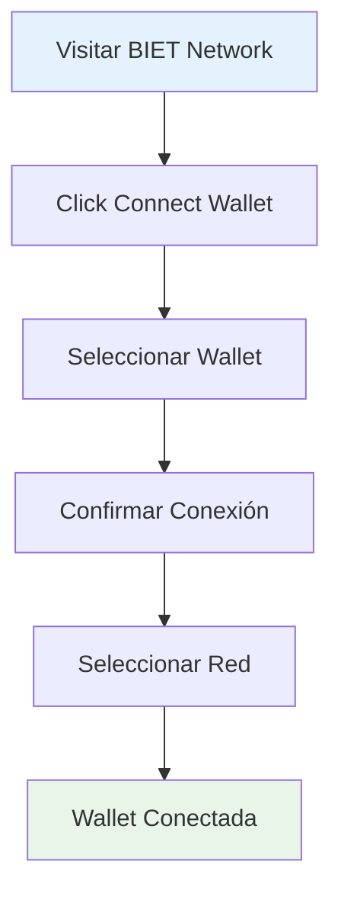

# Guía Rápida

Comienza a usar BIET Network en menos de 5 minutos. Esta guía te llevará paso a paso a través del proceso de configuración y tu primera inversión de impacto.

## Requisitos Previos

- [MetaMask](https://metamask.io/) o wallet compatible
- ETH o tokens para gas fees
- Conexión a internet estable

## Paso 1: Conectar tu Wallet

1. Visita [BIET Network](https://bietnetwork.org)
2. Haz clic en **"Connect Wallet"** en la esquina superior derecha
3. Selecciona tu wallet preferida (MetaMask, WalletConnect, etc.)
4. Confirma la conexión en tu wallet
5. Selecciona la red Ethereum o Polygon según prefieras

## Paso 2: Obtener Tokens BIET

Los tokens BIET son necesarios para participar en la gobernanza y acceder a beneficios adicionales.

### Opción A: Comprar en DEX
1. Ve a [Uniswap](https://app.uniswap.org) o [QuickSwap](https://quickswap.exchange)
2. Busca el token BIET
3. Intercambia ETH/USDC por BIET
4. Transfiere los tokens a tu wallet conectada

### Opción B: Obtener a través de Staking
1. Navega a la sección [Staking](https://bietnetwork.org/staking)
2. Stake otros tokens para recibir BIET como recompensa
3. Espera el período de staking
4. Reclama tus tokens BIET

## Paso 3: Explorar Proyectos de Impacto

1. Ve a la sección [Proyectos](https://bietnetwork.org/projects)
2. Filtra por categoría de impacto:
   - 🌱 **Ambiental**: Reforestación, energías renovables
   - 👥 **Social**: Educación, salud, inclusión financiera
   - 💧 **Agua**: Acceso a agua potable, saneamiento
3. Revisa las métricas de impacto y retornos esperados
4. Haz clic en un proyecto para ver detalles completos

## Paso 4: Tu Primera Inversión

1. Selecciona el proyecto de tu interés
2. Revisa los detalles:
   - Métricas de impacto verificadas
   - Retorno anual esperado
   - Duración del proyecto
   - Organización de verificación
3. Haz clic en **"Invertir Ahora"**
4. Ingresa el monto en ETH/USDC
5. Confirma la transacción en tu wallet
6. Espera la confirmación en blockchain

## Paso 5: Monitorear tu Impacto

1. Ve a tu [Dashboard](https://bietnetwork.org/dashboard)
2. Revisa tus inversiones activas
3. Monitorea las métricas de impacto en tiempo real
4. Recibe notificaciones de actualizaciones

### Métricas Disponibles

- 📊 **Impacto Real**: Datos verificables del proyecto
- 💰 **Retornos**: Ganancias generadas
- 🌍 **Contribución**: Tu impacto individual
- 📈 **Progreso**: Avance del proyecto

## Paso 6: Participar en Gobernanza (Opcional)

Como holder de tokens BIET, puedes:

1. **Votar en Propuestas**
   - Nuevos proyectos de impacto
   - Cambios en el protocolo
   - Distribución de fondos

2. **Proponer Proyectos**
   - Sugerir nuevas iniciativas de impacto
   - Proponer mejoras al protocolo

3. **Staking de Gobernanza**
   - Stake BIET para poder de voto adicional
   - Recibir recompensas por participación

## Consejos para Principiantes

### 💡 Start Small
Comienza con pequeñas inversiones mientras aprendes el sistema.

### 🔍 Haz tu Propia Investigación
Revisa siempre:
- La legitimidad del proyecto
- Historial de la organización
- Métricas de impacto verificables

### 🌱 Diversifica
Distribuye tus inversiones entre diferentes tipos de impacto.

### 📚 Sigue Aprendiendo
Mantente informado sobre:
- Nuevos proyectos
- Actualizaciones del protocolo
- Tendencias de impacto

## Recursos Adicionales

- [Configuración Avanzada de Wallet](/docs/guides/wallet-setup)
- [Guía de Inversión Detallada](/docs/guides/first-investment)
- [Gobernanza y Votación](/docs/guides/governance)
- [FAQ](/docs/resources/faq)

## ¿Necesitas Ayuda?

- 📧 **Email**: support@bietnetwork.org
- 💬 **Discord**: [Únete a nuestra comunidad](https://discord.gg/bietnetwork)
- 🐦 **Twitter**: [@BIETNetwork](https://twitter.com/bietnetwork)
- 📖 **Documentación: Ver navegación lateral para más temas**

## ¡Felicidades! 🎉

Ahora estás listo para:
- ✅ Invertir en proyectos de impacto
- ✅ Monitorear tu impacto real
- ✅ Participar en la gobernanza
- ✅ Generar retornos financieros

Bienvenido a la revolución de la inversión de impacto descentralizada. **Juntos estamos creando un futuro más sostenible y equitativo.**

---

**Siguiente paso**: [Configurar tu wallet para características avanzadas](/docs/guides/wallet-setup)
