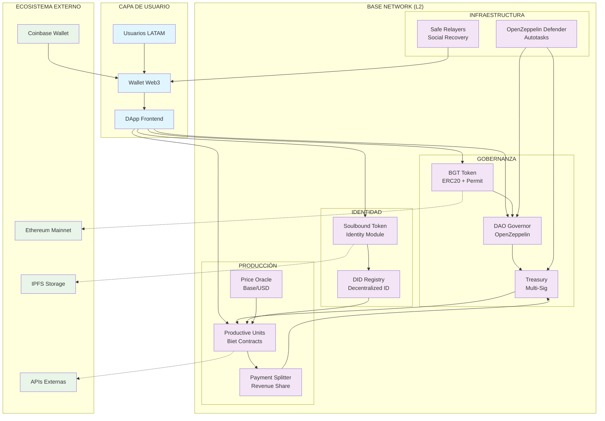

# Arquitectura Web3 - Red Biet

## Diagrama de Arquitectura

## Componentes Principales

### 1. BGT Token (ERC20 + Permit)
- **Standard**: ERC20 con extensión Permit (EIP-2612)
- **Supply**: 1,000,000,000 BGT (fijo)
- **Utility**: Gobernanza, staking, utilidades en la red
- **Gas Optimization**: Permit para approve sin gas

### 2. DAO Governor
- **Framework**: OpenZeppelin Governor Bravo
- **Quorum**: 4% del supply total
- **Voting Period**: 7 días
- **Execution Delay**: 2 días
- **Proposal Threshold**: 1% del supply

### 3. Treasury Module
- **Arquitectura**: Gnosis Safe multi-sig (3/5)
- **Asset Management**: ETH, USDC, BGT
- **Autotasks**: Defender para operaciones automáticas
- **Transparency**: Todas las transacciones on-chain

### 4. Identity Module
- **SBT**: Soulbound Token para identidad verificada
- **DID**: Decentralized Identifier registry
- **Verification**: KYC simplificado via Coinbase
- **Privacy**: Datos sensibles off-chain (IPFS)

### 5. Productive Units
- **Contratos**: Factory pattern para Biets
- **Metadata**: IPFS para descripciones
- **Revenue Share**: Automático via PaymentSplitter
- **Compliance**: Regulatory-friendly

## Flujo de Operaciones

### Onboarding de Usuario
1. Conectar wallet (Coinbase Wallet优先)
2. Mint SBT de identidad
3. Receive initial BGT airdrop
4. Join Productive Unit

### Gobernanza
1. Delegate BGT tokens
2. Create/Propose improvements
3. Vote on proposals
4. Execute via DAO

### Transacciones Económicas
1. Productive Unit genera revenue
2. PaymentSplitter distribuye automáticamente
3. Treasury recibe comisión
4. Stakeholders reciben pagos

## Stack Técnico

### Smart Contracts
- **Lenguaje**: Solidity ^0.8.19
- **Framework**: Foundry
- **Librerías**: OpenZeppelin Contracts
- **Testing**: Foundry Test Framework
- **Deployment**: Foundry Scripts

### Frontend Integration
- **Web3**: Ethers.js v6 + Wagmi v2
- **UI**: React + TailwindCSS
- **State**: Zustand
- **Components**: shadcn/ui

### Infrastructure
- **Network**: Base (L2)
- **Relayers**: Safe + Defender
- **Storage**: IPFS (Pinata)
- **API**: The Graph para indexing

## Security Considerations

1. **Multi-sig Treasury**: 3/5 firmas requeridas
2. **Time Lock**: 48h para ejecución de propuestas
3. **Upgradeability**: Proxy pattern para contratos críticos
4. **Audit**: Contratos auditados por terceros
5. **Bug Bounty**: Programa de recompensas

## Cost Optimization

### Gas en Base
- **Transfer ERC20**: ~0.0001 ETH
- **Vote**: ~0.0002 ETH
- **Create Proposal**: ~0.0005 ETH
- **Mint SBT**: ~0.0001 ETH

### Batch Operations
- **Airdrops**: Merkle tree distribution
- **Mass Minting**: Factory pattern
- **Revenue Distribution**: PaymentSplitter

## Roadmap de Implementación

### Phase 1: Core Infrastructure
- [x] Setup Foundry project
- [ ] BGT Token implementation
- [ ] DAO Governor setup
- [ ] Treasury deployment

### Phase 2: Identity & Production
- [ ] SBT Identity module
- [ ] Productive Unit factory
- [ ] PaymentSplitter integration
- [ ] Price oracle setup

### Phase 3: Frontend & UX
- [ ] Web3 wallet integration
- [ ] Governance interface
- [ ] Dashboard de Biets
- [ ] Mobile optimization

### Phase 4: Ecosystem
- [ ] API integrations
- [ ] Analytics dashboard
- [ ] Community tools
- [ ] Expansion tokens
